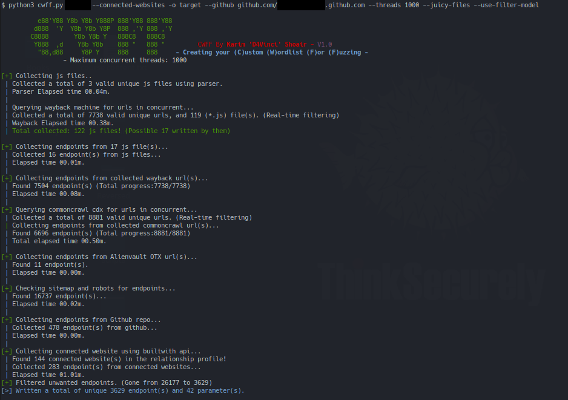

# CWFF - Custom wordlists for fuzzing
CWFF is a tool that creates a special High quality fuzzing/content discovery wordlist for you at the highest speed possible using concurrency and it's heavily inspired by [@tomnomnom](https://github.com/tomnomnom)'s [Who, What, Where, When, Wordlist #NahamCon2020](https://www.youtube.com/watch?v=W4_QCSIujQ4).

</img>

## Usage
```
CWFF [-h] [--threads] [--github] [--subdomains] [--recursive] [--js-libraries] [--connected-websites] [--juicy-files] [--use-filter-model] [-o] domain

positional arguments:
  domain                Target website(ofc)

optional arguments:
  -h, --help            Show this help message and exit
  --threads             The number of maximum concurrent threads to use (Default:1000)
  --github              Collect endpoints from a given github repo (ex:https://github.com/google/flax)
  --subdomains          Extract endpoints from subdomains also while search in the wayback machine!
  --recursive           Work on extracted endpoints recursively (Adds more endpoints but less accurate sometimes)!
  --js-libraries        Extract endpoints from JS libraries also, not just the JS written by them!
  --connected-websites  Include endpoints extracted from connected websites
  --juicy-files         Include endpoints extracted from juicy files like sitemap.xml and robots.txt
  --use-filter-model    Filter result endpoints with filter_model file
  -o                    The output directory for the endpoints and parameters. (Default: website name)
```

# Description (Important)
So it basically collects endpoints and parameters of the target and its subdomains using many sources we will talk about them now:

1. Archive wayback machine: it goes through all records of the target website and its subdomains and pulls urls that gives 200 status code.

  A lot of tools goes through the top page only of wayback to save time but here we go through all records at little time but this also makes it takes a lot of time when you use `--subdomains` flag.

2. Javascript files that's collected during the wayback phase and the ones collected by parsing the target page for `<script>` tag

  CWFF tries to separate the JS libraries from the JS files actually written by website developers and it does that by looking into JS files names.
  By default, CWFF extracts endpoints from the JS files written by developers only, to use JS libraries (Mostly not helpful) activate the `--js-libraries` flag.

3. Common crawl CDX index and Alien vault OTX (Open Threat Exchange)
4. If you gave CWFF the `--juicy-files` flag, it would also extract endpoints from files like Sitemap.xml and robots.txt (Could add more in the future)
5. If you gave CWFF a github repository using the `--github` flag, it would extract paths from that repo using Github API (No API key needed).

  Just to make it clear, CWFF would use the files and directories paths only so it won't extract endpoints from inside the files itself!

6. With using the `--connected-websites` flag, CWFF would use builtwith website API (Needs key but it's free) to extract the connected websites to the target from the relationship profile then extracts endpoints from these websites source.

  > Note: you can get your API key from [this page](https://api.builtwith.com/relationships-api) and set the variable at `API_keys.py` file.

After collecting endpoints from all these endpoints if you used the `--recursive` flag, CWFF would recursively extract parts from collected endpoints.
- Example: an endpoint like `parseq/javadoc/1.1.0/com` will become all these endpoints:
  ```bash
  parseq/javadoc/1.1.0/com
  parseq/javadoc/1.1.0/
  parseq/javadoc/
  parseq/
  javadoc/
  1.1.0/
  com
  ```
> Note: all endpoints/parameters collected are cleaned and sorted with no duplicates to have a unique result.

## Filtering results

Of course after all these sources and this work, there would be a lot of unwanted/useless endpoints among the important ones and here filtering comes to play to save time and resources.

In CWFF you can detect and remove the unwanted endpoints using three methods:
- Remove endpoints that ends with any string from a given list (extensions for example).
- Remove endpoints that contains any string from a given list of strings.
- And finally the big one, remove endpoints that a match any regular expressions from a given list also.

All this filter options can be given by setting the variables at `filter_model.py` file then use the `--use-filter-model` flag while starting CWFF. If you don't have an idea how to set this variables, see the comments I left in the file it's the one I mostly use and in the screenshot it lowered the number of collected endpoints from 26,177 to 3629.
In case you forgot to use filtering while running CWFF, don't worry I got you covered :smile:

You can use script `filter.py` to filter endpoints you have as the following way and it would load the `filter_model.py` file automatically without having to rerun CWFF:
  ```bash
  python filter.py wordlist.txt output.txt
  ```

## Requirements
- Python 3.6+
- It should work on any operating system but I only tested it on Linux Manjaro.
- The following instructions

## Installation
```bash
python3 -m pip install -r requirements.txt
python3 cwff.py --help
```

## Contact
- [Twitter](https://twitter.com/D4Vinci1)
- [Telegram](https://t.me/D4Vinci_0x)

## TODO
- Merge endpoints recursively
- Extract website unique words by comparing to RFC.

## Donation
If my work has been useful for you, feel free to thank me by buying me a coffee.

[](https://buymeacoffee.com/d4vinci)

## Disclaimer
CWFF is created to help in penetration testing and it's not responsible for any misuse or illegal purposes.

Copying a code from this tool or using it in another tool is accepted as you mention the source :smile
